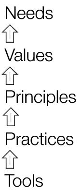

<link href="markdown.css" rel="stylesheet"></link>

# The Spine Model

The model is used to map human organisational systems. Once you have mapped a system you can...

* think about it in a far more useful way
* generate new insights about why things are the way they are
* make explicit and intentional changes
* resolve unhealthy conflict
* measure it
* compare different systems
 
Any system that requires humans to do work can be effectively mapped - most commonly this is done at a team level, however the model can be applied to a system boundary as narrow as a single meeting, or as wide as an entire organisation.

# What is it?

Based on a chain of levels, the model that can be thought of as vertebrae of a spine:

--{ <a href="needs.html">Needs</a>       }--  
--{ <a href="values.html">Values</a>      }--  
--{ <a href="principles.html">Principles</a>  }--  
--{ <a href="practices.html">[Practices]</a> }--  
--{ <a href="tools.html">Tools</a>       }--

You always measure against the highest level. The higher levels should set the frame for what is acceptable lower down (e.g. does this practice *satisfy* all the higher levels?).

So, the higher levels sets the bounds in which creativity can foster.

# Why is it useful?

The structure of a human organisational system can be either implicit or explicit. By making the structure explicit, starting at the reason the system exists in the first place "Needs", your chances of having a well functioning system are greatly enhanced.

By mapping a system you create an opportunity for useful conversations to occur, and actions to be chosen that are ecologically appropriate for the system.

# How can I use it?

TODO

 Spine Model is licensed under a <a rel="license" href="http://creativecommons.org/licenses/by/4.0/">Creative Commons Attribution 4.0 International License</a>.