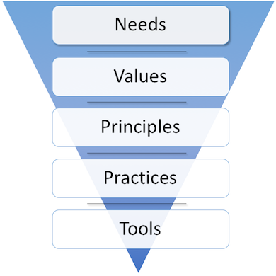

<link href="markdown.css" rel="stylesheet"></link>

# The Spine Model

The model is used to map human organisational systems. Once you have mapped a system you can...

* think about it in a far more useful way
* generate new insights about why things are the way they are
* make explicit and intentional changes
* resolve unhealthy conflict
* measure it
* compare different systems

 
Any system that requires humans to do work can be effectively mapped - most commonly this is done at a team level, however the model can be applied to a system boundary as narrow as a single meeting, or as wide as an entire organisation.

*This is a concise description of the model. For a more detailed description, <a href="index.html">read the full story</a>.*

# Spine Model Fundamentals

Needs > Values > Principles > Practices > Tools.

## The 5 fundamental assertions of the Spine Model are:

1. Before you can know which Tools to use, you need to decide what Practices are important.
1. Before you can know which Practices are important, you need to know which Principles apply.
1. Before you can know which Principles apply, you need to know what Values you are optimising for.
1. Before you can know which Values are important to optimise for, you need to know what Needs the system exists to satisfy.
1. Before you can know which Needs are important to satisfy, you need to define the boundaries of the system you talking about.

## Definition of Terms:

**Needs** - Firstly, at a system level, through the eyes of its creators, owners or sponsors, why does this system exist? Secondly, at an individual level, what needs I hope to have met through being a part of this system? 

Answers the question: *The system exists in order that ______ .* 

**Values** - Firstly, at a system level, if you have these things you are most likely to meet the Need. Secondly, at a personal level, these are the things that will keep me in the system. 

Answers the question: *We optimise the system for ______.*

**Principles** - These are the cause-effect dynamics by which we believe the system behaves, and how we will take advantage of them. 

Answers the question: *We leverage _____ to maintain or change the system.*

**Practices** - These are the concrete activities we use to get the work done. 

Answers the question: *We do _____ to create or increase value.*

**Tools** - These are the automations and mechanisations that make the work easier to do. 

Answers the question: *We use _____ to get the work done more efficiently.*

## Examples:

**Needs**

* Organisational level: We make money
* Team level: We ensure a particular service is supplied. 
* Individual level: We satisfy my need for self-expression.

**Values** 

* Feedback
* Communication 
* Respect
  
**Principles** 

* Batch Size - Decreasing batch sizes of completed work increase the regularity of feedback.
* Work in Progress - By limiting work in progress to the capacity of the system we increase throughput
* Flexible boundaries - Prefer heuristics over hard rules

**Practices** 

* Daily Stand Up meetings
* Annual performance reviews
* Lunch hour

**Tools** 

* Email
* JIRA
* CRM

 
*This has been a concise description of the model. For a more detailed description, <a href="index.html">read the full story</a>.*

