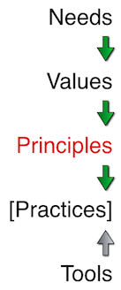

<link href="markdown.css" rel="stylesheet"></link>

# Principles
Can best be described as "ecological levers". They are the switches and dials that you can use to effect a desired change to a system. They are the universal truths and rules that govern the behaviours of all human organisational systems. 

## Heuristics
System boundaries can be put in place by providing heuristic rules to govern a particular principle.

People tend to remember heuristic better when they come in threes. For example we often use these three for teams:

* **Increase** feedback [TODO: link to feedback principle]
* **Decrease** batch size (see <a href="principles/batch-size.html">Batch size</a> principle)
* **Pull** work through the system [TODO: link to push-vs-pull principle]

This does not tell teams what practices to use, however they can be measured against whether or not they are applying the principles in a desirable way.

